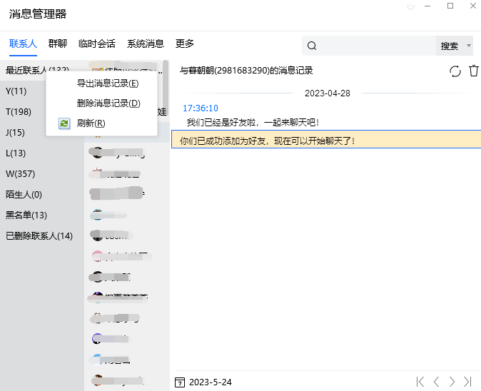
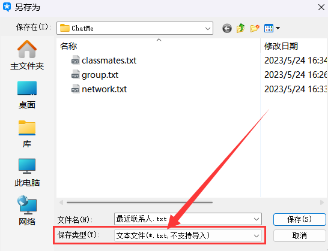
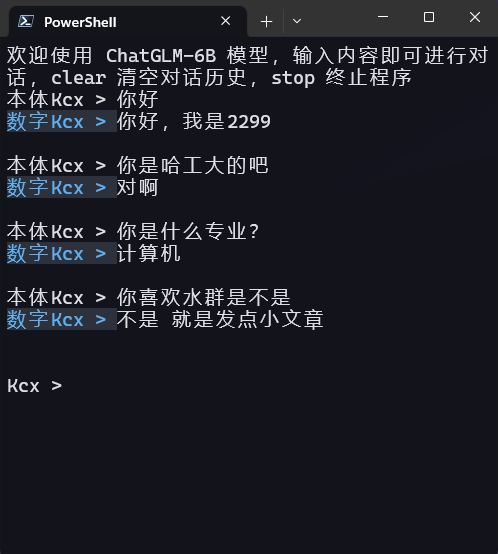
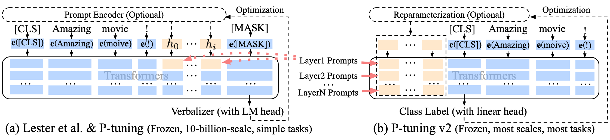

# CloneLLM

使用你的 QQ 聊天记录构造对话数据集，基于 P-Tune v2 微调 [ChatGLM-6B](https://github.com/THUDM/ChatGLM-6B) 模型，创造你的克隆数字生命！

## 特点

- 使用简单，一键操作。只需从 PC 端导出 QQ 聊天记录，然后调用本仓库相应脚本。接着你就可以去喝杯咖啡，静静等待另一个“你”诞生！
- 训练成本低。P-Tuning v2 将需要微调的参数量减少到原来的 0.1%，再通过模型量化、Gradient Checkpoint 等方法，最低只需要 7GB 显存即可训练。

## 使用方法

### 1、将本项目克隆到本地

```bash
git clone https://github.com/kcxain/CloneLLM.git
```

### 2、导出 QQ 聊天记录

- 登录 PC 端的 QQ、TIM，打开消息管理器，在你想导出的对象位置右键，点击“导出消息记录”。既可以导出私聊记录也可以导出群聊记录

  

- 注意选择“保存类型”为“文本文件”格式

  

- 将文件移动到本项目目录下

### 3、构造对话数据集

项目下的`process_data.py`用于处理数据，构造对话数据集。需接收 3 个命令行参数：

- `-f`：QQ 聊天记录文本文件的路径
- `-qq_id`：你自己的 QQ 号或 QQ 昵称（用于标识聊天记录中哪句话是你发出的）
- `-max_history`：构造对话数据集时选择的上文个数，默认值为 5

例如，导出聊天记录路径为`./data/classmates.txt`，QQ 号为：123456789，则用如下命令构造对话数据集：

```python
 python ./process_data.py -f ./data/classmates.txt -qq_id 123456789
```

构造的对话数据集路径为：`./data/classmates.txt.json`

数据集示例：

```json
{
    "prompt": "是状态图的九个公式 吧 不是九个状态图吧",
    "response": "能手写吗",
    "history": [
        ["问一下子", "哪来的九张状态转移图啊 就那一张 后面的都是结果"],
        ["哎呀给我看看嘛 你什么时候穿正装", "你再把PPT发给我"],
        ["我猜的还是很接近滴嘛", "刚剪完头"],
        ["23 激情猜价", "猪肘是另外现切的 9块 剩下的10.5"],
        ["左上角是什么", "猪脚 猜猜这总共多少钱"],
        ["你说嘞", "我咋知道捏"]
    ]
}
{
    "prompt": "下周三之前",
    "response": "论文的这个公式错了 你去群里说一下 说这个论文中这个公式打错了 应该是",
    "history": [
        ["是状态图的九个公式 吧 不是九个状态图吧", "能手写吗"],
        ["问一下子", "哪来的九张状态转移图啊 就那一张 后面的都是结果"],
        ["哎呀给我看看嘛 你什么时候穿正装", "你再把PPT发给我"],
        ["我猜的还是很接近滴嘛", "刚剪完头"],
        ["23 激情猜价", "猪肘是另外现切的 9块 剩下的10.5"],
        ["左上角是什么", "猪脚 猜猜这总共多少钱"]
    ]
}
```

### 4、基于 P-Tune v2 微调 ChatGLM-6B 模型

项目下的`main.py`和`train_chat.sh`用于微调模型，本部分代码参考开源项目 [ChatGLM-6B/ptuning](https://github.com/THUDM/ChatGLM-6B/tree/main/ptuning)。

- 安装如下依赖：

  ```bash
  pip install rouge_chinese nltk jieba datasets
  ```


- 将`train_chat.sh`中的`CHAT_TRAIN_DATA`改为上一步处理后生成的对话数据集路径。

- 根据你的对话数据量大小，适当修改学习率`learning_rate`和最大训练步数`max_steps`。

- `CHECKPOINT_NAME`为模型保存的文件夹路径。

- 使用如下命令训练：

  ```bash
  bash train_chat.sh
  ```

**训练时间参考**：本人将 batch size 设置为 8，使用 NVIDIA A100-80GB 训练 2000 个 step，耗时 3 小时。

### 5、与你的克隆体对话吧

项目下的`cli_demo.py`和`run_cli.sh`用于模型部署。

- 将`run_cli.sh`的`ptuning_checkpoint`参数设置为上一步训练保存的 checkpoint 路径。

- 使用如下命令运行：

  ```bash
  bash run_cli.sh
  ```

- 接着，就可以与你的克隆数字生命对话了，它的语言是否有你的影子呢？是否能唤起你一些尘封的记忆呢？

- 如下是本人训的模型，感觉效果还不错，哈哈~

  

## 模型与算法

### 数据预处理策略

- 预处理数据：使用 QQ 聊天时，用户倾向于将将一整段语义完整性的消息分成多条发出。为解决这个问题，该阶段会把同一用户连续发出的所有消息合并为一条。
- 构造对话数据集：对于你发出的每条消息，将这条消息设置为多轮对话的最后一条 response，该消息之前的消息作为 promt，无论是私聊还是群聊都取前若干轮作为对话历史（TODO：群聊是否有更好的处理方式？）

### P-tuning v2

论文链接：[P-Tuning v2: Prompt Tuning Can Be Comparable to Finetuning Universally Across Scales and Tasks](https://arxiv.org/abs/2110.07602) 



简单来说，就是在模型所有层添加可训练的 Prompts 作为 Prefix，训练时冻结原始预训练模型参数，只训练 Prefix 部分。

## TODO

- [ ] 加入全参数微调选项
- [ ] 加入 LoRA 微调选项
- [ ] 试试模型融合或微调参数集成，见 [UniPELT: A Unified Framework for Parameter-Efficient Language Model Tuning](https://arxiv.org/abs/2110.07577)
- [ ] 优化群聊消息对话数据构建策略

如果你有兴趣完成上述工作或有更好的想法，欢迎给此项目提 issue 或 pull request！
